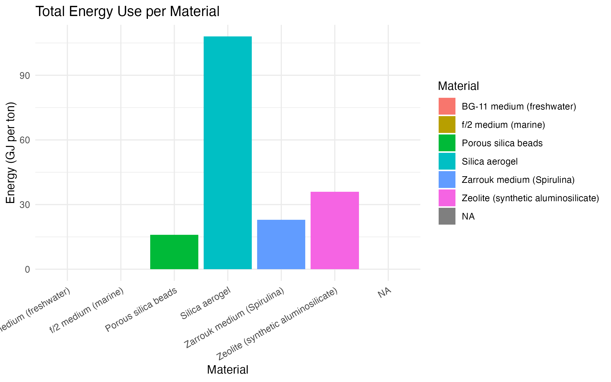
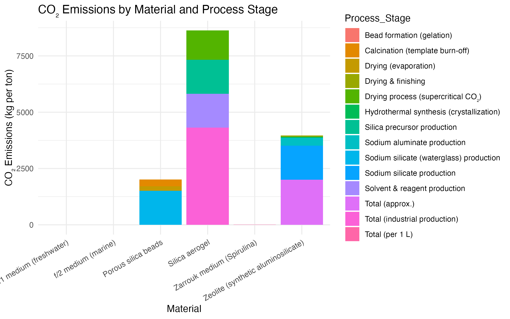

# Comparative Energy and Emissions Analysis of Clean Tech Materials

## 🌍 Purpose

This project compares the energy use and carbon dioxide (CO₂) emissions involved in producing three widely used clean tech materials: **porous silica beads**, **zeolites**, and **soda-lime glass**. These materials are central to innovations in renewable energy, catalysis, filtration, and medical technologies—yet the environmental cost of their production remains under-analyzed in policy and industrial contexts.

By quantifying emissions and energy input at each manufacturing stage, this project highlights opportunities to improve sustainability in material design and process engineering. It also contributes data-driven insight to broader conversations about climate policy, industrial decarbonization, and energy equity.


## 📊 Research Overview

This analysis draws on technical documentation and industrial Life Cycle Assessments (LCAs) to evaluate:

- **Stages of production:** raw material preparation, core processing (e.g., drying, crystallization, melting), and finishing (e.g., milling, annealing).
- **Metrics computed:**  
  - Total energy consumption (GJ/ton)  
  - CO₂ emissions (kg/ton)  
  - CO₂ intensity per unit energy (kg/GJ)

Data cleaning, aggregation, and visualization were done in **R**, emphasizing reproducibility and clarity.


## 🔎 Key Findings

- **Glass** has the highest energy and carbon footprint due to high-temperature melting processes.
- **Zeolites** show moderate emissions, particularly during synthesis and calcination stages.
- **Porous silica beads** are the least resource-intensive, with the lowest energy use and CO₂ emissions across all stages.

A consistent **CO₂-per-GJ ratio** across materials suggests that decarbonizing the **energy source** (e.g., replacing fossil fuels with renewables) would yield high-impact reductions in emissions—regardless of material type.


## 🧠 Broader Implications

- Highlights the need to evaluate not just material performance, but **manufacturing sustainability**.
- Provides actionable insight for **industrial engineers, clean tech startups, sustainability researchers, and policy makers**.
- Supports decarbonization efforts by identifying the most emission-intensive production stages and offering a reproducible modeling approach.



## 🛠 Tools and Technologies

- **R (v4.3+)**
- `tidyverse` for data manipulation
- `ggplot2` for visualization
- `RMarkdown` for reporting

## 📄 License

This project is licensed under the [MIT License](LICENSE) © 2025 [Alice Pigelet](https://github.com/alicepigelet).

## 🔁 Reproducibility

To reproduce the analysis:

```bash
git clone https://github.com/alicepigelet/R-Energy-Comparison-Project.git

